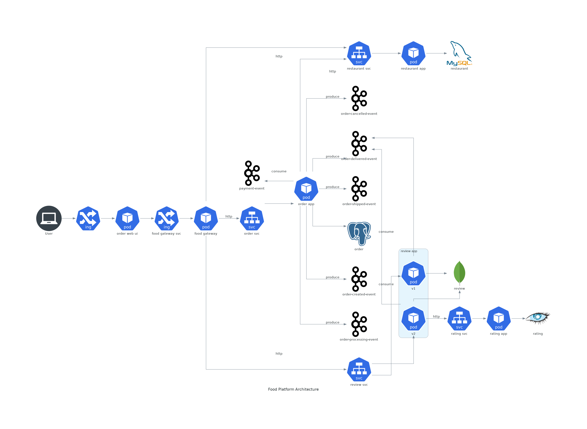

## Food Platform

Describe project here...

### Infrastructure configuration
- Kubernetes ([minikube](https://minikube.sigs.k8s.io/docs/start/))
- Istio (1.7.3)

```
cd warmup-project
kubectl apply -f 1-istio-init.yaml
kubectl apply -f 2-istio-configuration-minikube.yaml
kubectl apply -f 3-istio-addons-kiali-prometheus-grafana-jaeger.yaml
kubectl apply -f 4-kiali-secret.yaml
kubectl apply -f 5-label-default-namespace.yaml
```

### Istio tools

- [Kiali](http://192.168.99.100:31000/)
- [Jaeger](http://192.168.99.100:31001/)
- [Grafana](http://192.168.99.100:31002/)

### Project Architecture


